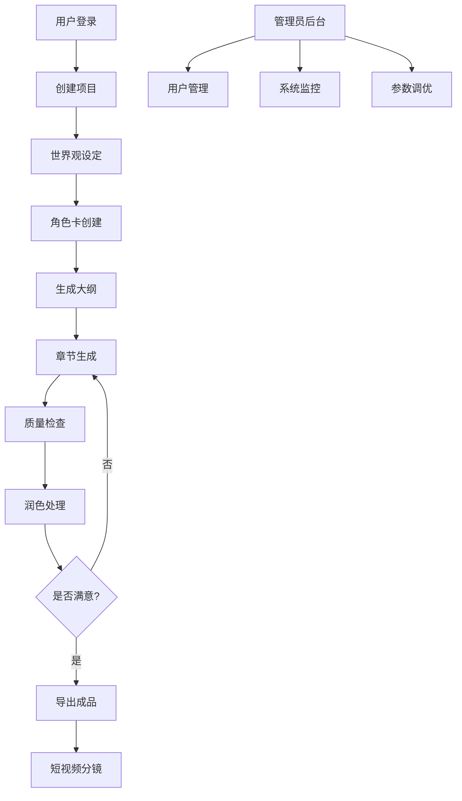

# 自动化小说生成流水线系统 - 产品需求文档

## 1. Product Overview

本产品是一个可复用、可自动化、质量稳定的长篇小说生成流水线系统，通过结构化的子任务分解，利用LLM技术实现从世界观设定到最终导出的完整小说创作流程。

系统将写作过程拆分为世界观设定、角色卡生成、章节大纲、逐章生成、校对润色、一致性检查、输出导出等模块，使用LLM作为"写手+编辑+校验器"，并通过摘要/检索/嵌入(RAG)技术保证跨章连贯性。

目标是让用户能够自动产出几万字且质量可控的小说，并支持导出为多种格式，包括适合短视频平台的分镜脚本。

## 2. Core Features

### 2.1 User Roles

| Role | Registration Method | Core Permissions |
|------|---------------------|------------------|
| 普通用户 | 邮箱注册 | 创建项目、生成短篇小说(≤5章)、基础导出功能 |
| 高级用户 | 付费升级 | 无限制章节生成、高级润色功能、批量导出、API访问 |
| 管理员 | 系统分配 | 用户管理、系统配置、模型参数调优、数据统计 |

### 2.2 Feature Module

我们的自动化小说生成系统包含以下主要页面：

1. **项目管理页面**：项目创建、项目列表、项目配置管理
2. **世界观设定页面**：体裁选择、世界观生成、规则设定
3. **角色管理页面**：人物卡创建、角色关系图、角色一致性管理
4. **大纲编辑页面**：章节大纲生成、结构调整、剧情节点设置
5. **章节生成页面**：逐章生成、实时预览、生成参数调节
6. **质量控制页面**：润色处理、一致性检查、质量评估
7. **导出管理页面**：多格式导出、短视频分镜、批量处理
8. **用户中心页面**：账户管理、使用统计、订阅管理

### 2.3 Page Details

| Page Name | Module Name | Feature description |
|-----------|-------------|---------------------|
| 项目管理页面 | 项目创建 | 创建新小说项目，设置基本信息(标题、体裁、目标字数) |
| 项目管理页面 | 项目列表 | 显示所有项目，支持搜索、筛选、删除操作 |
| 项目管理页面 | 项目配置 | 设置生成参数(temperature、max_tokens等)，模型选择 |
| 世界观设定页面 | 体裁选择 | 选择小说体裁(现代都市/悬疑/玄幻/科幻等)，设置基调 |
| 世界观设定页面 | 世界观生成 | 基于模板生成世界观JSON，包含设定规则和风格示例 |
| 世界观设定页面 | 规则管理 | 编辑和维护世界观规则，确保后续生成的一致性 |
| 角色管理页面 | 人物卡创建 | 创建结构化角色卡(姓名、外貌、背景、动机等) |
| 角色管理页面 | 关系图谱 | 可视化角色关系，管理角色间的互动和秘密 |
| 角色管理页面 | 一致性检查 | 检测角色在不同章节中的行为和性格一致性 |
| 大纲编辑页面 | 大纲生成 | 基于世界观和角色自动生成30-80章的章节大纲 |
| 大纲编辑页面 | 结构调整 | 手动编辑章节顺序、合并或拆分章节 |
| 大纲编辑页面 | 剧情节点 | 设置关键剧情点、反转点和伏笔位置 |
| 章节生成页面 | 逐章生成 | 基于大纲和前情摘要生成具体章节内容 |
| 章节生成页面 | 实时预览 | 实时显示生成进度和章节内容预览 |
| 章节生成页面 | 参数调节 | 调整生成参数(创造性、长度、风格等) |
| 质量控制页面 | 自动润色 | 使用LLM对章节进行语言润色和表达优化 |
| 质量控制页面 | 矛盾检查 | 检测时间线冲突、人物行为矛盾、道具不一致 |
| 质量控制页面 | 质量评估 | 对章节质量进行评分，提供改进建议 |
| 导出管理页面 | 格式导出 | 导出为TXT、EPUB、PDF等多种格式 |
| 导出管理页面 | 短视频分镜 | 将章节拆分为适合抖音等平台的短视频脚本 |
| 导出管理页面 | 批量处理 | 批量导出多个项目或章节 |
| 用户中心页面 | 账户管理 | 用户信息编辑、密码修改、登录历史 |
| 用户中心页面 | 使用统计 | 显示生成字数、项目数量、API调用次数 |
| 用户中心页面 | 订阅管理 | 查看和管理付费订阅，升级账户等级 |

## 3. Core Process

### 普通用户流程
用户注册登录后，创建新的小说项目，选择体裁和基调，系统自动生成世界观设定。用户创建主要角色卡片，系统基于世界观和角色生成章节大纲。用户可以调整大纲后开始逐章生成，系统自动进行润色和质量检查，最后导出为所需格式。

### 高级用户流程
高级用户除了基础流程外，还可以访问高级参数调节、批量生成、API接口等功能。可以创建更长的小说项目，使用更复杂的角色关系和剧情结构。

### 管理员流程
管理员可以监控系统运行状态，管理用户账户，调整模型参数，查看使用统计和系统性能数据。

## 4. User Interface Design

### 4.1 Design Style

- **主色调**：深蓝色(#1e3a8a)作为主色，浅蓝色(#3b82f6)作为辅助色
- **按钮风格**：圆角矩形按钮，带有轻微阴影效果
- **字体**：中文使用思源黑体，英文使用Inter，主要字号14px-16px
- **布局风格**：卡片式布局，左侧导航栏，顶部面包屑导航
- **图标风格**：使用Heroicons图标库，简洁线性风格
- **动画效果**：页面切换使用淡入淡出，按钮点击有微动效果

### 4.2 Page Design Overview

| Page Name | Module Name | UI Elements |
|-----------|-------------|-------------|
| 项目管理页面 | 项目列表 | 卡片网格布局，每个项目卡片显示封面、标题、进度条、操作按钮 |
| 世界观设定页面 | 设定表单 | 分步骤表单，左侧预览区域，右侧参数设置面板 |
| 角色管理页面 | 角色卡片 | 可拖拽的角色卡片，支持分组和标签筛选 |
| 大纲编辑页面 | 章节树 | 可折叠的树形结构，支持拖拽排序和内联编辑 |
| 章节生成页面 | 生成界面 | 左侧参数面板，中间内容编辑器，右侧实时预览 |
| 质量控制页面 | 检查结果 | 问题列表视图，带有优先级标识和修复建议 |
| 导出管理页面 | 导出选项 | 格式选择器，进度条显示，下载链接管理 |

### 4.3 Responsiveness

系统采用桌面优先设计，同时适配平板设备。主要功能针对桌面端的内容创作场景优化，在平板上提供基本的查看和轻量编辑功能。不支持手机端的复杂编辑操作，但提供移动端的项目查看和简单管理功能。