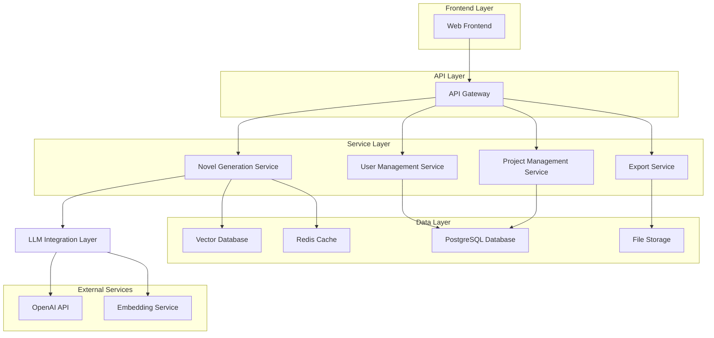
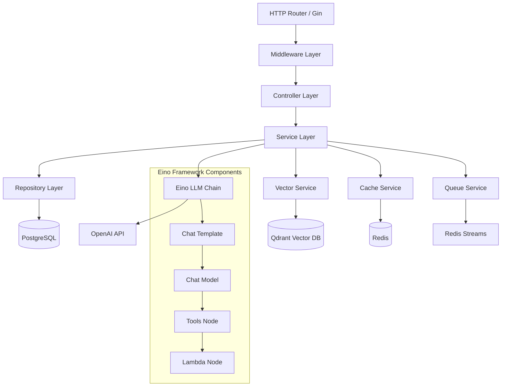
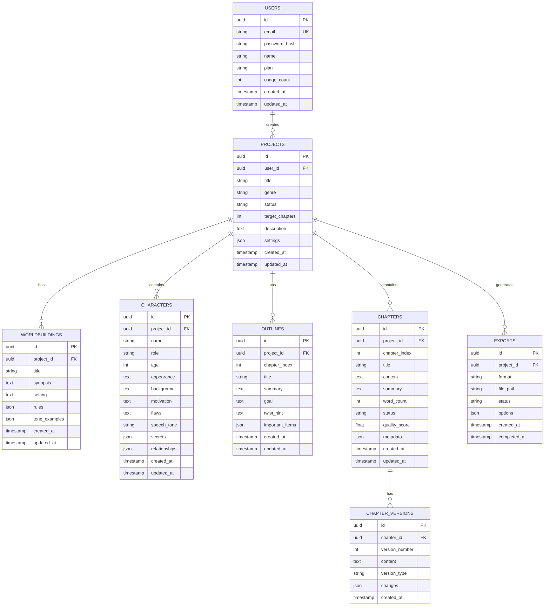

# 自动化小说生成流水线系统 - 技术架构文档

## 1. Architecture design



## 2. Technology Description

* **Frontend**: React\@18 + TypeScript + Tailwind CSS + Vite

* **Backend**: Go\@1.21 + Eino Framework + Gin + GORM

* **Database**: PostgreSQL\@15 (主数据库) + Redis\@7 (缓存) + Qdrant (向量数据库)

* **Message Queue**: Redis Streams

* **File Storage**: MinIO (本地) / AWS S3 (云端)

* **Monitoring**: Prometheus + Grafana

## 3. Route definitions

| Route                       | Purpose           |
| --------------------------- | ----------------- |
| /                           | 首页，项目概览和快速入口      |
| /login                      | 用户登录页面            |
| /register                   | 用户注册页面            |
| /dashboard                  | 用户仪表板，显示项目列表和统计信息 |
| /projects                   | 项目管理页面，创建和管理小说项目  |
| /projects/:id/worldbuilding | 世界观设定页面           |
| /projects/:id/characters    | 角色管理页面            |
| /projects/:id/outline       | 大纲编辑页面            |
| /projects/:id/generation    | 章节生成页面            |
| /projects/:id/quality       | 质量控制页面            |
| /projects/:id/export        | 导出管理页面            |
| /profile                    | 用户个人中心            |
| /admin                      | 管理员后台             |

## 4. API definitions

### 4.1 Core API

**用户认证相关**

```
POST /api/auth/login
```

Request:

| Param Name | Param Type | isRequired | Description |
| ---------- | ---------- | ---------- | ----------- |
| email      | string     | true       | 用户邮箱        |
| password   | string     | true       | 用户密码        |

Response:

| Param Name  | Param Type | Description |
| ----------- | ---------- | ----------- |
| token       | string     | JWT访问令牌     |
| user        | object     | 用户基本信息      |
| expires\_at | string     | 令牌过期时间      |

**项目管理相关**

```
POST /api/projects
```

Request:

| Param Name       | Param Type | isRequired | Description |
| ---------------- | ---------- | ---------- | ----------- |
| title            | string     | true       | 项目标题        |
| genre            | string     | true       | 小说体裁        |
| target\_chapters | int        | false      | 目标章节数       |
| description      | string     | false      | 项目描述        |

Response:

| Param Name  | Param Type | Description |
| ----------- | ---------- | ----------- |
| id          | string     | 项目ID        |
| title       | string     | 项目标题        |
| status      | string     | 项目状态        |
| created\_at | string     | 创建时间        |

**世界观生成相关**

```
POST /api/projects/:id/worldbuilding/generate
```

Request:

| Param Name     | Param Type | isRequired | Description |
| -------------- | ---------- | ---------- | ----------- |
| genre          | string     | true       | 小说体裁        |
| audience       | string     | true       | 目标读者        |
| tone           | string     | true       | 基调风格        |
| custom\_prompt | string     | false      | 自定义提示词      |

Response:

| Param Name     | Param Type | Description |
| -------------- | ---------- | ----------- |
| worldbuilding  | object     | 生成的世界观JSON  |
| generation\_id | string     | 生成任务ID      |

**角色管理相关**

```
POST /api/projects/:id/characters
```

Request:

| Param Name    | Param Type | isRequired | Description |
| ------------- | ---------- | ---------- | ----------- |
| name          | string     | true       | 角色姓名        |
| role          | string     | true       | 角色定位        |
| age           | int        | false      | 角色年龄        |
| appearance    | string     | false      | 外貌描述        |
| background    | string     | false      | 背景故事        |
| motivation    | string     | false      | 行动动机        |
| flaws         | string     | false      | 性格缺陷        |
| speech\_tone  | string     | false      | 说话风格        |
| secrets       | array      | false      | 角色秘密        |
| relationships | object     | false      | 人物关系        |

**章节生成相关**

```
POST /api/projects/:id/chapters/generate
```

Request:

| Param Name     | Param Type | isRequired | Description |
| -------------- | ---------- | ---------- | ----------- |
| chapter\_index | int        | true       | 章节序号        |
| goal           | string     | true       | 本章目标        |
| min\_words     | int        | false      | 最少字数        |
| max\_words     | int        | false      | 最多字数        |
| temperature    | float      | false      | 创造性参数       |
| style\_prompt  | string     | false      | 风格提示        |

Response:

| Param Name       | Param Type | Description |
| ---------------- | ---------- | ----------- |
| content          | string     | 生成的章节内容     |
| word\_count      | int        | 字数统计        |
| generation\_time | float      | 生成耗时        |
| quality\_score   | float      | 质量评分        |

**质量控制相关**

```
POST /api/projects/:id/chapters/:chapter_id/polish
```

Request:

| Param Name   | Param Type | isRequired | Description                      |
| ------------ | ---------- | ---------- | -------------------------------- |
| content      | string     | true       | 原始章节内容                           |
| polish\_type | string     | true       | 润色类型(language/consistency/style) |

Response:

| Param Name         | Param Type | Description |
| ------------------ | ---------- | ----------- |
| polished\_content  | string     | 润色后内容       |
| changes            | array      | 修改建议列表      |
| improvement\_score | float      | 改进评分        |

## 5. Server architecture diagram



## 6. Data model

### 6.1 Data model definition



### 6.2 Data Definition Language

**用户表 (users)**

```sql
-- 创建用户表
CREATE TABLE users (
    id UUID PRIMARY KEY DEFAULT gen_random_uuid(),
    email VARCHAR(255) UNIQUE NOT NULL,
    password_hash VARCHAR(255) NOT NULL,
    name VARCHAR(100) NOT NULL,
    plan VARCHAR(20) DEFAULT 'free' CHECK (plan IN ('free', 'premium', 'enterprise')),
    usage_count INTEGER DEFAULT 0,
    created_at TIMESTAMP WITH TIME ZONE DEFAULT NOW(),
    updated_at TIMESTAMP WITH TIME ZONE DEFAULT NOW()
);

-- 创建索引
CREATE INDEX idx_users_email ON users(email);
CREATE INDEX idx_users_plan ON users(plan);
```

**项目表 (projects)**

```sql
-- 创建项目表
CREATE TABLE projects (
    id UUID PRIMARY KEY DEFAULT gen_random_uuid(),
    user_id UUID NOT NULL REFERENCES users(id) ON DELETE CASCADE,
    title VARCHAR(200) NOT NULL,
    genre VARCHAR(50) NOT NULL,
    status VARCHAR(20) DEFAULT 'draft' CHECK (status IN ('draft', 'generating', 'completed', 'archived')),
    target_chapters INTEGER DEFAULT 30,
    description TEXT,
    settings JSONB DEFAULT '{}',
    created_at TIMESTAMP WITH TIME ZONE DEFAULT NOW(),
    updated_at TIMESTAMP WITH TIME ZONE DEFAULT NOW()
);

-- 创建索引
CREATE INDEX idx_projects_user_id ON projects(user_id);
CREATE INDEX idx_projects_status ON projects(status);
CREATE INDEX idx_projects_genre ON projects(genre);
CREATE INDEX idx_projects_created_at ON projects(created_at DESC);
```

**世界观表 (worldbuildings)**

```sql
-- 创建世界观表
CREATE TABLE worldbuildings (
    id UUID PRIMARY KEY DEFAULT gen_random_uuid(),
    project_id UUID NOT NULL REFERENCES projects(id) ON DELETE CASCADE,
    title VARCHAR(200) NOT NULL,
    synopsis TEXT,
    setting TEXT,
    rules JSONB DEFAULT '[]',
    tone_examples JSONB DEFAULT '[]',
    created_at TIMESTAMP WITH TIME ZONE DEFAULT NOW(),
    updated_at TIMESTAMP WITH TIME ZONE DEFAULT NOW()
);

-- 创建索引
CREATE INDEX idx_worldbuildings_project_id ON worldbuildings(project_id);
```

**角色表 (characters)**

```sql
-- 创建角色表
CREATE TABLE characters (
    id UUID PRIMARY KEY DEFAULT gen_random_uuid(),
    project_id UUID NOT NULL REFERENCES projects(id) ON DELETE CASCADE,
    name VARCHAR(100) NOT NULL,
    role VARCHAR(50) NOT NULL,
    age INTEGER,
    appearance TEXT,
    background TEXT,
    motivation TEXT,
    flaws TEXT,
    speech_tone VARCHAR(100),
    secrets JSONB DEFAULT '[]',
    relationships JSONB DEFAULT '{}',
    created_at TIMESTAMP WITH TIME ZONE DEFAULT NOW(),
    updated_at TIMESTAMP WITH TIME ZONE DEFAULT NOW()
);

-- 创建索引
CREATE INDEX idx_characters_project_id ON characters(project_id);
CREATE INDEX idx_characters_role ON characters(role);
```

**大纲表 (outlines)**

```sql
-- 创建大纲表
CREATE TABLE outlines (
    id UUID PRIMARY KEY DEFAULT gen_random_uuid(),
    project_id UUID NOT NULL REFERENCES projects(id) ON DELETE CASCADE,
    chapter_index INTEGER NOT NULL,
    title VARCHAR(200) NOT NULL,
    summary TEXT,
    goal TEXT,
    twist_hint TEXT,
    important_items JSONB DEFAULT '[]',
    created_at TIMESTAMP WITH TIME ZONE DEFAULT NOW(),
    updated_at TIMESTAMP WITH TIME ZONE DEFAULT NOW(),
    UNIQUE(project_id, chapter_index)
);

-- 创建索引
CREATE INDEX idx_outlines_project_id ON outlines(project_id);
CREATE INDEX idx_outlines_chapter_index ON outlines(project_id, chapter_index);
```

**章节表 (chapters)**

```sql
-- 创建章节表
CREATE TABLE chapters (
    id UUID PRIMARY KEY DEFAULT gen_random_uuid(),
    project_id UUID NOT NULL REFERENCES projects(id) ON DELETE CASCADE,
    chapter_index INTEGER NOT NULL,
    title VARCHAR(200) NOT NULL,
    content TEXT,
    summary TEXT,
    word_count INTEGER DEFAULT 0,
    status VARCHAR(20) DEFAULT 'draft' CHECK (status IN ('draft', 'generating', 'completed', 'polished')),
    quality_score FLOAT DEFAULT 0.0,
    metadata JSONB DEFAULT '{}',
    created_at TIMESTAMP WITH TIME ZONE DEFAULT NOW(),
    updated_at TIMESTAMP WITH TIME ZONE DEFAULT NOW(),
    UNIQUE(project_id, chapter_index)
);

-- 创建索引
CREATE INDEX idx_chapters_project_id ON chapters(project_id);
CREATE INDEX idx_chapters_status ON chapters(status);
CREATE INDEX idx_chapters_chapter_index ON chapters(project_id, chapter_index);
CREATE INDEX idx_chapters_quality_score ON chapters(quality_score DESC);
```

**章节版本表 (chapter\_versions)**

```sql
-- 创建章节版本表
CREATE TABLE chapter_versions (
    id UUID PRIMARY KEY DEFAULT gen_random_uuid(),
    chapter_id UUID NOT NULL REFERENCES chapters(id) ON DELETE CASCADE,
    version_number INTEGER NOT NULL,
    content TEXT NOT NULL,
    version_type VARCHAR(20) DEFAULT 'manual' CHECK (version_type IN ('manual', 'auto_polish', 'auto_fix')),
    changes JSONB DEFAULT '[]',
    created_at TIMESTAMP WITH TIME ZONE DEFAULT NOW(),
    UNIQUE(chapter_id, version_number)
);

-- 创建索引
CREATE INDEX idx_chapter_versions_chapter_id ON chapter_versions(chapter_id);
CREATE INDEX idx_chapter_versions_created_at ON chapter_versions(created_at DESC);
```

**导出表 (exports)**

```sql
-- 创建导出表
CREATE TABLE exports (
    id UUID PRIMARY KEY DEFAULT gen_random_uuid(),
    project_id UUID NOT NULL REFERENCES projects(id) ON DELETE CASCADE,
    format VARCHAR(20) NOT NULL CHECK (format IN ('txt', 'epub', 'pdf', 'video_script')),
    file_path VARCHAR(500),
    status VARCHAR(20) DEFAULT 'pending' CHECK (status IN ('pending', 'processing', 'completed', 'failed')),
    options JSONB DEFAULT '{}',
    created_at TIMESTAMP WITH TIME ZONE DEFAULT NOW(),
    completed_at TIMESTAMP WITH TIME ZONE
);

-- 创建索引
CREATE INDEX idx_exports_project_id ON exports(project_id);
CREATE INDEX idx_exports_status ON exports(status);
CREATE INDEX idx_exports_created_at ON exports(created_at DESC);
```

**初始化数据**

```sql
-- 插入管理员用户
INSERT INTO users (email, password_hash, name, plan) VALUES 
('admin@autonovel.com', '$2a$10$example_hash', '系统管理员', 'enterprise');

-- 插入示例项目数据
INSERT INTO projects (user_id, title, genre, description) VALUES 
((SELECT id FROM users WHERE email = 'admin@autonovel.com'), '示例现代都市小说', '现代都市', '这是一个示例项目，展示系统的基本功能');
```

